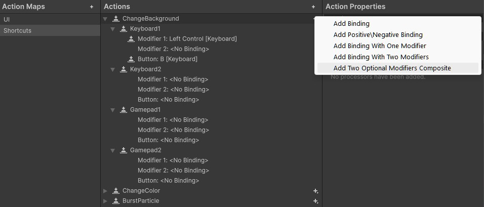
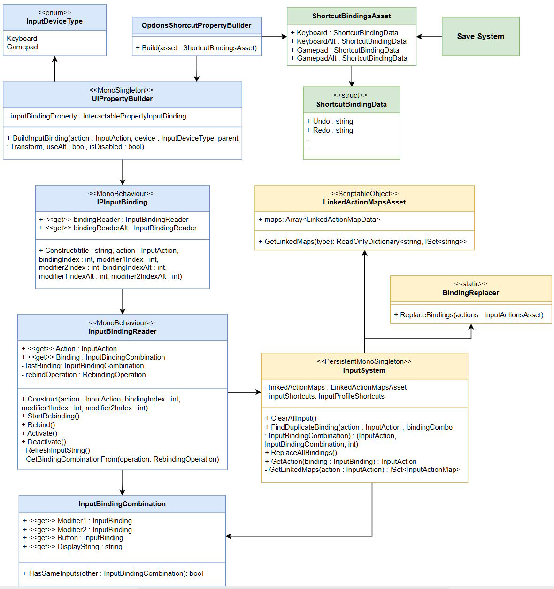

This is a free shortcut/hotkey linking and remapping system for Unity that allows:

- Linking Input Event Actions to UnityEvents.
- Switching between Action Maps based on currently active shortcuts.
- Remapping actions for both Keyboard+Mouse and Gamepad.
- Remapping Input Action bindings with variable combination length. (CTRL+Z -> CTRL+SHIFT+Z)
- Having 2 bindings per device.
- Remapping of composite bindings by spawning a reader for each composite part.
- Saving and loading of remapped bindings to/from JSON files.

Tested in Unity 6000.1.2f1. Requires usage of the New Input System.

# Structure & Requirements
The package is split into 3 assembly definitions:

### **RedRats.Core**
- Contains general scripts, used by the other two assemblies.
- Requires **TextMeshPro** as a reference.

### **RedRats.ShortcutSystem**
- Contains the core shortcut linking + remapping system.
- Requires **Input System**, **TextMeshPro** and **RedRats.Core** as a reference.

### **RedRats.ShortcutSystem.Examples**
- Contains the example scene with 3 remappable actions, affecting properties of a particle. All 3 actions can be remapped to a variable combination (max 3 buttons).
- Requires **Unity.InputSystem**, **TextMeshPro**, **RedRats.Core** and **RedRats.ShortcutSystem** as a reference.

# Prepare Input Actions 

To allow an Input Action to have a binding, which can be remapped to any number of buttons (max 3 in combination), follow:

1. For the Input Action, create a binding of type `TwoOptionalModifiersComposite`. This composite is used to mark the binding, allowing it to be detected by the system.
2. Set the default paths. If you want for example, a combination of CTRL+Z, set it as leftCTRL, "", Z.
3. Make sure you create a binding for both supported devices, otherwise you'll get an error.
4. If you want to make use of alternative/second bindings (setting `useAlt = true` in the system's methods), create a second binding for each device.

To have an empty binding in the editor, press the **T** button next to the path field and empty the path's text.

# Project Setup
To make use of the property that allows remapping of combinations, the `InputBindingReader`, some setup is required:

#### Prefabs
1. Create a new prefab for the InputBindingReader. It must have the components of `InputDetectingButton` and `InputBindingReader` on it. This prefab is supposed to represent a rebinding button.
    
    You can also copy the prefab from the added example (_pref_InputBindingReader_Red_) and modify it.
2. Create a new prefab for the UI element, that will carry the rebinding buttons. It must have the component `IPInputBinding` on it. This one represents a rebinder for a single Input Action, containing it's title and readers for both bindings.

   You can also copy the prefab from the added example (_pref_Property_InputBinding_Red_) and modify it.
3. Add the component `UIPropertyBuilder` to your scene and assign it the property prefab. This one handles the creation of your Rebinding UI elements.

#### Input System
1. Add the component `InputSystem` to your scene. It takes in a `LinkedActionMapsAsset`, which is a ScriptableObject that tells the system, which Action Maps work together (for example a General map with undo, redo & save should be active together with a Room Editor Action Map, which adds in additional actions).
2. You're going to have to edit the code of `InputSystem`. It needs to work with the C# class of your Input Actions (tick Generate C# class on your input actions asset) so replace the `TestInputActions` in InputSystem with your own actions.
3. Next you need to create a profile class which will hold all your actions. This class must inherit from `InputProfileBase`. Look at the existing example of `InputProfileShortcuts`, create your own class and add it to `InputSystem`.

#### Modal Window
When the user types an already existing binding, the system shows a modal window that asks them for their next move. 

1. Create a prefab for the modal window. It must have the component `ModalWindow` on itself. It will represent the window that pops up when a duplicate is found.

   You can also copy the prefab from the added example (_pref_ModalWindow_) and modify it.
2. Add components `ModalWindowBuilder` and `ModalWindowGenerator` to your scene and assign their fields.

# Spawn InputBindingReader
After the setup, to use the InputBindingReader UI property in your project, you have to spawn it at runtime through code via the method `UIPropertyBuilder.Instance.BuildInputBinding()`.
Set its values like where in the hierarchy will it spawn, which action it affects, for which device and if it will allow to remap both the main and alternative binding.

# Linking Input Actions to events
To link Input Actions to your Unity events, follow these steps:

1. Add the component `ShortcutProfile` to your menu. It contains links between Input Actions and events. These links are only active when GameObject is.
2. To activate specific ActionMaps when the GameObject is activated, add the component `ShortcutMapActivator`. It needs some code editing though. For each Action Map that contains your shortcuts, add an enum value to `ShortcutActionMapType` and an activation line to ShortcutMapActivator's `OnEnable` method.

This system is completely separate from the remapping system and should work even without the project setup.

# Supporting systems

-- Where to replace UIBuilder

-- where to replace Modal Window

- **InputBindingReader** - 
- **IPInputBinding** - 
- **InputBindingCombination** - 
- **UIPropertyBuilder** - 
- **InputDeviceType** -
- **InputSystem** - 
- Binding **Replacer** -
- **LinkedActionMapsAsset** -
- **ShortcutBindingsAsset** -
- **ShortcutBindingData** -
- **JSONShortcutBindingAsset** -
- **JSONSystem** -

# System in detail
-- add the master thesis here

# Credits
Fonts used in the example:

- Perfect DOS VGA 437 by Zeh Fernando
- Bit Cell by memesbruh03