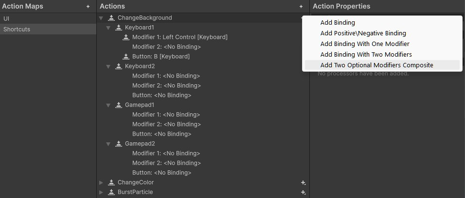
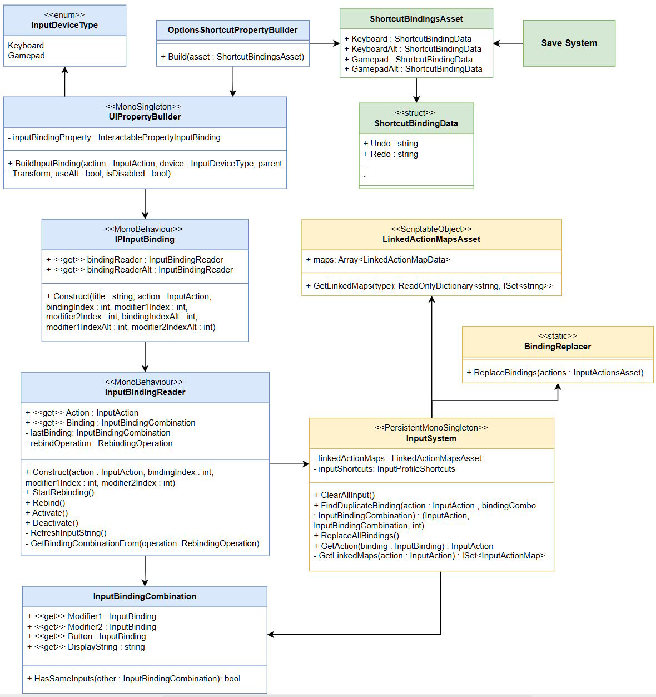

# Shortcut System with Rebinding
This is a free shortcut/hotkey linking and remapping system for Unity that allows:

- Linking Input Event Actions to UnityEvents.
- Switching between Action Maps.
- Remapping actions for both Keyboard+Mouse and Gamepad.
- **Remapping Input Action bindings with variable combination length. (CTRL+Z -> CTRL+SHIFT+Z)**
- Having up to 2 bindings per device.
- Remapping of composite bindings by spawning a reader for each composite part.
- Saving and loading remapped bindings to/from a JSON file.

Tested in Unity 6000.1.2f1. Requires usage of **the New Input System**.

## Structure & Requirements
The package is split into 3 assembly definitions with predefined references. Make sure you have the required packages imported from the Package Manager.

### **RedRats.Core**
- Contains general scripts that are used by the other two assemblies.
- Requires **TextMeshPro** as a reference.

### **RedRats.ShortcutSystem**
- Contains the core shortcut linking + remapping system.
- Requires **Input System**, **TextMeshPro** and **RedRats.Core** as a reference.

### **RedRats.ShortcutSystem.Examples**
- Contains an example scene with 3 remappable actions that affect properties of a particle. All 3 actions can be remapped to a variable combination (max 3 buttons).
- Requires **Unity.InputSystem**, **TextMeshPro**, **RedRats.Core** and **RedRats.ShortcutSystem** as a reference.

## Prepare your Input Actions 

To allow an Input Action to have a binding, which can be remapped to up to 3 buttons, follow:

1. For your Input Action, create a binding of type `TwoOptionalModifiersComposite`. This composite is used to mark the binding, allowing it to be detected by the system as one which can store variable combinatons.
2. Set the default paths for your keys/buttons. If you want for example, a combination of CTRL+Z, set it as leftCTRL, "", Z.
3. Make sure you create a binding for both supported devices (Keyboard+Mouse & Gamepad). **Assign correct control schemes**, otherwise you'll get an error.
4. If you want to make use of alternative (second) bindings (by setting `useAlt = true` in the system's methods), you must create a second binding for each device. (like Keyboard1 and Keyboard2 in the image.)

To have an empty binding in the editor, press the **T** button next to the path field and empty the path's text.

## Project Setup
To make use of the UI property that handles the remapping of combinations, the `InputBindingReader`, some setup is required:

#### Prefabs
1. Create a new prefab for the InputBindingReader. It must have the components of `InputDetectingButton` and `InputBindingReader` on it. This prefab represents a rebinding button for a single binding.
    
    You can copy the prefab from the added example (_pref_InputBindingReader_Red_) and modify it.
2. Create a new prefab for the UI element, that will carry both rebinding buttons and store text, saying which Input Action is being remapped. It must have the component `IPInputBinding` on it.

   You can copy the prefab from the added example (_pref_Property_InputBinding_Red_) and modify it.
3. Add the component `UIPropertyBuilder` to your scene and assign it the IPInputBinding prefab. This one handles the creation of your Rebinding UI elements.

#### Input System
1. Add the component `InputSystem` to your scene. It takes in a `LinkedActionMapsAsset`, which is a ScriptableObject that tells the system, which Action Maps should be active together (for example a General map with undo, redo & save should be active together with a Room Editor Action Map, which adds in additional actions).
2. You're going to have to edit the code of `InputSystem`. It needs to work with the C# class of your Input Actions (tick Generate C# class on your Input Actions Asset) so replace the `TestInputActions` in InputSystem with your own actions.
3. Next you need to create a profile class which will hold all your actions. This class must inherit from `InputProfileBase`. Look at the existing example of `InputProfileShortcuts`, create your own class and add it to `InputSystem`.

#### Custom Composite Replacement
Unity does not know, how to use TwoOptionalModifiersComposite bindings. To actually use these bindings in-game, they **have to be replaced by built-in composites**. (for example CTRl+Z will be replaced by a `OneModifierComposite`.)
Follow these steps to set up this behaviour:

1. Add a string representation of your wanted Input Action to `ShortcutBindingData`.

   (This data is used in `ShortcutBindingsAsset` where it is stored 4 times. For each device and for main and alt bindings.)
2. Your Input Action's bindings must be copied over into this variable. This is handled in the static class `ShortcutToAssetConverter` via methods `Get()` and `Load()`. Duplicate the code in both methods from the provided examples and just change the values.
3. Create a class that will control the ShortcutBindingsAsset itself. (In the example it is `InputBindingEditor`). it will contain the asset itself and at least 2 methods: SaveChanges() and StartEditing().
   For the class's content, look the mentioned example class `InputBindingEditor`.
4. The `SaveChanges()` method should be called when the user is done remapping (for example leaving the options menu).
5. The `StartEditing()` method should be called when the user enters the remapping menu. (for example entering the options menu).

#### Modal Window
When the user types into a reader an already existing combination, the system shows a modal window that asks them for their next move. In order to spawn the window, the scene must contain some components:

1. Create a prefab for the modal window. It must have the component `ModalWindow` on itself. It will represent the window that pops up when a duplicate is found.

   You can copy the prefab from the added example (_pref_ModalWindow_) and modify it.
2. Add components `ModalWindowBuilder` and `ModalWindowGenerator` to your scene and assign their fields. That should be enough for a window to spawn when needed.

## Spawn InputBindingReader
After the setup, to use the InputBindingReader UI property in your project, you have to spawn it at runtime through code via the method `UIPropertyBuilder.Instance.BuildInputBinding()`.
Set its parameters like where in your hierarchy will it spawn, which Input Action it affects, for which device and if it will allow to remap both the main and alternative binding.

## Linking Input Actions to events
To link Input Actions to your Unity events, follow these steps:

1. Add the component `ShortcutProfile` to your menu. It contains links between Input Actions and events. These links are only active when the component's GameObject is.
2. To activate specific ActionMaps when the GameObject is activated, add the component `ShortcutMapActivator`. It needs some code editing though. For each Action Map that contains your shortcuts, add an enum value to `ShortcutActionMapType` and an activation line to ShortcutMapActivator's `OnEnable` method, based on the provided example.

This system is completely separate from the remapping system and should work even without the project setup.

## How to Save/Load
To save and load your remapped bindings to an external file you must call the methods `ExternalStorageOverseer.Instance.Save()` and `ExternalStorageOverseer.Instance.Load()`. The built-in file system will handle the rest.

By default, the file is saved in the **persistent data path** of the application (_AppData/LocalLow/COMPANY/PROJECT_NAME_). To change this, go to ExternalStorageOverseer and edit the `SaveableData` parameters in the code snippet: `shortcutBindingsCRUD.RefreshSaveableData(new SaveableData("", "01"));` Giving a name to param1 will put the file into a folder in the persistent path and changing param3 will change the path completely.

## System Overview

- **InputBindingReader** - Represents a single reader that will remap a single binding. Contains methods for starting and finishing rebinding.
- **IPInputBinding** - Represents the whole UI element of an Action Map rebinder. Is made up of the Input Action's title and max of 2 rebinding buttons for the main & alt bindings.
- **TwoOptionalModifiersComposite** - A custom composite that allows a variable number of buttons to be used in a binding (max 3). It is used to mark the binding as remappable in that way.
- **InputBindingCombination** - A data class representing a combination of buttons. Is used by the system to pass contents of TwoOptionalModifiersComposite.
- **UIPropertyBuilder** - Builds Input Reader Ui elements. Spawns as many, as the composite requires. (Up/Down/Left/Right composite will spawn a reader for each direction)
- **InputDeviceType** - Enum, containing both supported devices (Keyboard+Mouse & Gamepad).
- **InputSystem** - Main Input controller. Allows accessing Input Actions and detecting duplicate combinations.
- **Binding Replacer** - Replaces TwoOptionalModifiersComposite bindings with built-in composites.
- **LinkedActionMapsAsset** - A ScriptableObject, containing Action Map clusters, that have to be activated together.
- **ShortcutBindingData** - Contains shortcut binding paths in text form. These must be added byt the programmer.
- **ShortcutBindingsAsset** - Contains ShortcutBindingData x 4. One for each device and for main and alt bindings. Is used to keep this data persistent while replacing TwoOptionalModifiersComposites with built-in ones. Also is used when saving/loading remappings to a file.
- **ExternalStorageOverseer** - Main interaction between other systems and the FileSystem. Use it to save/load your remapped bindings.

## Key Methods
- **InputBindingReader.StartRebinding()** - Starts the rebinding process. Call this when the user clicks on the rebinding button.
- **UIPropertyBuilder.Instance.BuildInputBinding()** - Spawns the InputBindingReader prefab with proper settings. Call this when you want to spawn a rebinding button into the hierarchy.
- **InputSystem.Instance.ReplaceAllBindings()** - Replaces all TwoOptionalModifiersComposite bindings with built-in composites. Call this when the user is done remapping.
- **InputSystem.Instance.ClearAllInput()** - Resets all Input Actions to their default values = reverts the effects of ReplaceAllBindings(). Call this when the menu for remapping is opened.
- **ExternalStorageOverseer.Instance.Save()** - Saves the remapped bindings to a file.
- **ExternalStorageOverseer.Instance.Load()** - Loads the remapped bindings from a file.

## System in detail
To understand the inner workings of the system in more detail, you can look in the attached thesis. (Unfortunately, it is only in Czech/Čeština).

[master_thesis(CZ)](Documentation_and_implementation_of_functions_that_improve_the_usability_of_the_software_Jan_Kunetka.pdf)

## Credits
Fonts used in the example:

- Perfect DOS VGA 437 by Zeh Fernando
- Bit Cell by memesbruh03

## Other Projects
#### Undo/Redo
- Besides this system I have also created an Undo/Redo system that supports Action Grouping.
- Available on GitHub: [RedRats.UndoRedoSystem](https://github.com/WaluigiNumber8/unity-undo-redo-system)